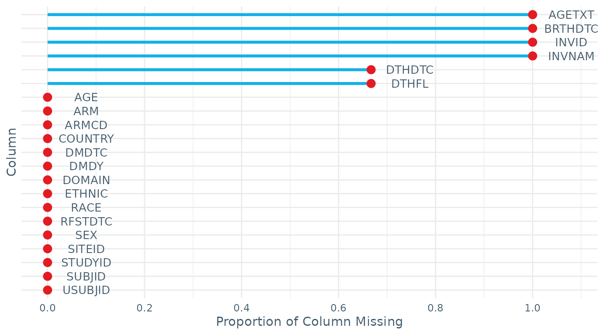
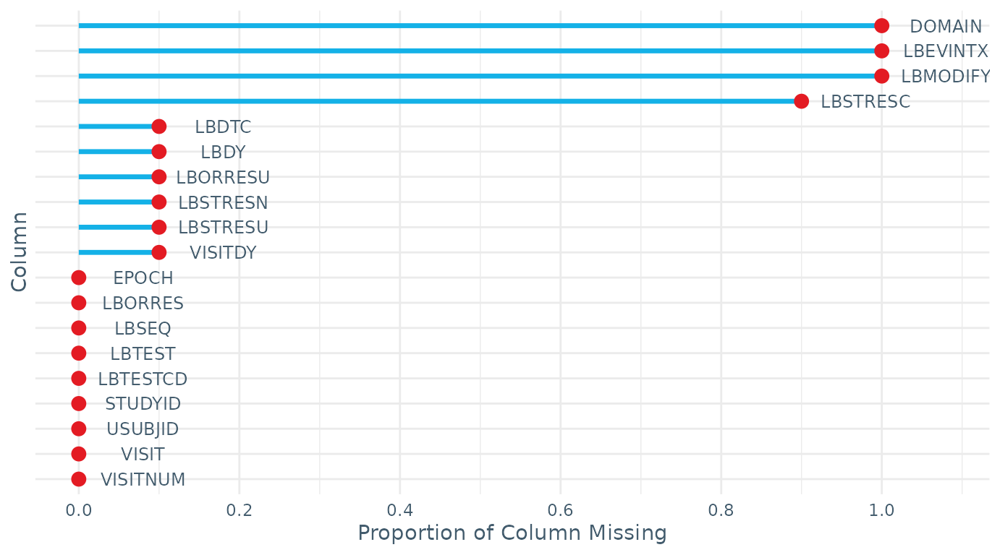

# iddoverse

Data requesters can use this package to support the transformation of
datasets from the storage data format used by IDDO, SDTM (Study Data
Tabulation Model) to analysis datasets. The package is intended for
epidemiologists, statisticians and data scientists with a diverse range
of programming ability, but with some familiarity with R software.
Advanced knowledge of the SDTM ontology is not required. This package
intends to minimise the time spent on data manipulation, whilst also
ensuring reproducibility and increases the accessibility of the SDTM
format. All functions come with documentation and examples which can be
viewed using the `?` command.

## Installing the Package

``` r
# uncomment the following lines to install these packages if required
# install.packages(c("devtools", "dplyr"))
# devtools::install_github("Infectious-Diseases-Data-Observatory/iddoverse")

library(iddoverse)
library(dplyr)
```

## Getting Started

Most of the data stored by IDDO uses the SDTM format, so when the data
is transferred to data requesters, there will be several datasets, each
with a specific purpose. These datasets are referred to as domains and
each have a two letter code (i.e. DM - demographics, MB - microbiology,
VS - vital signs).

Within the package, there are several synthetic, example domains that
can be used to gain familiarity with the IDDO-SDTM data. Each domain
starts with the two letter domain code followed by `_RPTESTB`

``` r
# demographics (DM) domain
DM_RPTESTB
#> # A tibble: 3 × 22
#>   STUDYID DOMAIN USUBJID SUBJID RFSTDTC DTHDTC DTHFL SITEID INVID INVNAM BRTHDTC
#>   <chr>   <chr>  <chr>    <dbl> <chr>   <chr>  <chr> <chr>  <lgl> <lgl>  <lgl>  
#> 1 RPTESTB DM     RPTEST…      1 2023/01 2023/… Y     OXFORD NA    NA     NA     
#> 2 RPTESTB DM     RPTEST…      2 2023/01 NA     NA    OXFORD NA    NA     NA     
#> 3 RPTESTB DM     RPTEST…      3 2023/02 NA     NA    OXFORD NA    NA     NA     
#> # ℹ 11 more variables: AGE <dbl>, AGETXT <lgl>, AGEU <chr>, SEX <chr>,
#> #   RACE <chr>, ETHNIC <chr>, ARMCD <chr>, ARM <chr>, COUNTRY <chr>,
#> #   DMDTC <chr>, DMDY <dbl>

# microbiology (MB) domain
MB_RPTESTB
#> # A tibble: 14 × 39
#>    STUDYID DOMAIN USUBJID     MBSEQ MBGRPID MBREFID MBTESTCD MBTEST     MBMODIFY
#>    <chr>   <chr>  <chr>       <dbl> <lgl>   <lgl>   <chr>    <chr>      <lgl>   
#>  1 RPTESTB MB     RPTESTB_001     1 NA      NA      PFALCIPA Plasmodiu… NA      
#>  2 RPTESTB MB     RPTESTB_001     2 NA      NA      PFALCIPA Plasmodiu… NA      
#>  3 RPTESTB MB     RPTESTB_001     3 NA      NA      PFALCIPA Plasmodiu… NA      
#>  4 RPTESTB MB     RPTESTB_001     4 NA      NA      PFALCIPA Plasmodiu… NA      
#>  5 RPTESTB MB     RPTESTB_002     1 NA      NA      PFALCIPA Plasmodiu… NA      
#>  6 RPTESTB MB     RPTESTB_002     2 NA      NA      PFALCIPA Plasmodiu… NA      
#>  7 RPTESTB MB     RPTESTB_002     3 NA      NA      PFALCIPA Plasmodiu… NA      
#>  8 RPTESTB MB     RPTESTB_002     4 NA      NA      PFALCIPA Plasmodiu… NA      
#>  9 RPTESTB MB     RPTESTB_002     5 NA      NA      PFALCIPA Plasmodiu… NA      
#> 10 RPTESTB MB     RPTESTB_002     6 NA      NA      PFALCIPA Plasmodiu… NA      
#> 11 RPTESTB MB     RPTESTB_003     1 NA      NA      PFALCIPA Plasmodiu… NA      
#> 12 RPTESTB MB     RPTESTB_003     2 NA      NA      PFALCIPA Plasmodiu… NA      
#> 13 RPTESTB MB     RPTESTB_003     3 NA      NA      PFALCIPA Plasmodiu… NA      
#> 14 RPTESTB MB     RPTESTB_003     4 NA      NA      PFALCIPA Plasmodiu… NA      
#> # ℹ 30 more variables: MBTSTDTL <chr>, MBCAT <lgl>, MBORRES <dbl>,
#> #   MBORRESU <chr>, MBSTRESC <dbl>, MBSTRESN <dbl>, MBSTRESU <chr>,
#> #   MBSTAT <lgl>, MBREASND <lgl>, MBNAM <lgl>, MBSPEC <chr>, MBSPCCND <lgl>,
#> #   MBLOC <chr>, MBMETHOD <chr>, VISITNUM <dbl>, VISIT <chr>, VISITDY <dbl>,
#> #   EPOCH <chr>, MBDTC <chr>, MBDY <dbl>, MBTPT <lgl>, MBTPTNUM <lgl>,
#> #   MBELTM <lgl>, MBTPTREF <lgl>, MBSTRF <lgl>, MBEVINTX <lgl>, MBSTRTPT <lgl>,
#> #   MBSTTPT <lgl>, MBCDSTDY <lgl>, MBRPOC <lgl>
```

## `prepare_domain()`

SDTM domains, such as the MB domain, can have up to 3 columns for the
results and a variety of over 20 timing variables, while this preserves
the intricacies in the trial data, it also creates complexity for
analysis.
[`prepare_domain()`](https://infectious-diseases-data-observatory.github.io/iddoverse/reference/prepare_domain.md)
takes a single IDDO-SDTM domain, amalgamates the data so that there is
one ‘best choice’ result and timing variable, then pivots the rows by
the best choice time variable (`TIME`, `TIME_SOURCE`), the study id
(`STUDYID`) and participant number (`USUBJID`). The different
events/findings/tests then become columns and the dataset is populated
with the associated result, providing a condensed dataset which is more
digestible can be easily merged with other data.

In
[`prepare_domain()`](https://infectious-diseases-data-observatory.github.io/iddoverse/reference/prepare_domain.md),
the first parameter is the two letter domain code followed by the domain
data frame.

``` r
prepare_domain("mb",
               MB_RPTESTB)
#> [1] "Number of rows where values_fn has been used to pick record in the MB domain: 0"
#> # A tibble: 14 × 5
#>    STUDYID USUBJID     TIME  TIME_SOURCE `PFALCIPA_10^6/L`
#>    <chr>   <chr>       <chr> <chr>       <chr>            
#>  1 RPTESTB RPTESTB_001 1     DY          899              
#>  2 RPTESTB RPTESTB_001 3     DY          0                
#>  3 RPTESTB RPTESTB_001 85    DY          450              
#>  4 RPTESTB RPTESTB_001 181   DY          2987             
#>  5 RPTESTB RPTESTB_002 1     DY          1056             
#>  6 RPTESTB RPTESTB_002 4     DY          48               
#>  7 RPTESTB RPTESTB_002 86    DY          0                
#>  8 RPTESTB RPTESTB_002 182   DY          0                
#>  9 RPTESTB RPTESTB_002 273   DY          0                
#> 10 RPTESTB RPTESTB_002 362   DY          0                
#> 11 RPTESTB RPTESTB_003 2     DY          989              
#> 12 RPTESTB RPTESTB_003 5     DY          0                
#> 13 RPTESTB RPTESTB_003 85    DY          167              
#> 14 RPTESTB RPTESTB_003 184   DY          0
```

These best choices follow a hierarchical list of variables, so for a
given row, if the first variable in the hierarchy list is not present,
the second will be used unless that is also empty, and so on. For
example, `MBSTRESN` (standardised numeric result) is initially used as
the best choice result variable, where rows have an empty `MBSTRESN`,
`MBSTRESC` (standardised character result) will be used, if there are
still empty rows `MBMODIFY` (modified original result) and finally
`MBORRES` (original result from data contributor) will be used to
populate the output.

With the best choice timing variable, there is a default hierarchy
though users are encouraged to specify the list of timing variables
which are most relevant to the study and objectives they have. For
example, a researcher may only want planned visit days as the timing
variable, so they can specify `VISITDY`. The `TIME_SOURCE` changes
compared to the previous example as the hierarchy has changed.

``` r
prepare_domain("MB",
               MB_RPTESTB,
               timing_variables = "VISITDY")
#> [1] "Number of rows where values_fn has been used to pick record in the MB domain: 0"
#> # A tibble: 14 × 5
#>    STUDYID USUBJID     TIME  TIME_SOURCE `PFALCIPA_10^6/L`
#>    <chr>   <chr>       <chr> <chr>       <chr>            
#>  1 RPTESTB RPTESTB_001 1     VISITDY     899              
#>  2 RPTESTB RPTESTB_001 3     VISITDY     0                
#>  3 RPTESTB RPTESTB_001 85    VISITDY     450              
#>  4 RPTESTB RPTESTB_001 182   VISITDY     2987             
#>  5 RPTESTB RPTESTB_002 1     VISITDY     1056             
#>  6 RPTESTB RPTESTB_002 3     VISITDY     48               
#>  7 RPTESTB RPTESTB_002 85    VISITDY     0                
#>  8 RPTESTB RPTESTB_002 182   VISITDY     0                
#>  9 RPTESTB RPTESTB_002 273   VISITDY     0                
#> 10 RPTESTB RPTESTB_002 366   VISITDY     0                
#> 11 RPTESTB RPTESTB_003 1     VISITDY     989              
#> 12 RPTESTB RPTESTB_003 3     VISITDY     0                
#> 13 RPTESTB RPTESTB_003 85    VISITDY     167              
#> 14 RPTESTB RPTESTB_003 182   VISITDY     0
```

Additional parameters include subsetting the output on the variables of
interest, by using `variables_include` to select just weight and
temperature in the VS domain example below:

``` r
prepare_domain("vs", 
               VS_RPTESTB, 
               variables_include = c("TEMP", "WEIGHT"))
#> [1] "Number of rows where values_fn has been used to pick record in the VS domain: 0"
#> # A tibble: 9 × 6
#>   STUDYID USUBJID     TIME  TIME_SOURCE TEMP_C WEIGHT_kg
#>   <chr>   <chr>       <chr> <chr>       <chr>  <chr>    
#> 1 RPTESTB RPTESTB_001 1     DY          36.2   60       
#> 2 RPTESTB RPTESTB_001 3     DY          37.4   NA       
#> 3 RPTESTB RPTESTB_001 42    DY          37.5   NA       
#> 4 RPTESTB RPTESTB_002 1     DY          37.5   42       
#> 5 RPTESTB RPTESTB_002 4     DY          37.2   NA       
#> 6 RPTESTB RPTESTB_002 40    DY          37.9   NA       
#> 7 RPTESTB RPTESTB_003 2     DY          37.2   9.6      
#> 8 RPTESTB RPTESTB_003 5     DY          37.1   NA       
#> 9 RPTESTB RPTESTB_003 3     VISITNUM    37.7   NA
```

The location (`LOC`) and method (`METHOD`) of a test or finding may be
required in the analysis dataset. `include_LOC` and `include_METHOD` can
be set to `TRUE` to include them in the column names of the test/finding
along with the units, (i.e. `TEMP_AXILLA_C`). If the location or method
is `NA`, then `NA` will appear in the column name (i.e. `WEIGHT_NA_kg`).

``` r
prepare_domain("vs", 
               VS_RPTESTB, 
               variables_include = c("TEMP", "WEIGHT"), 
               include_LOC = TRUE)
#> [1] "Number of rows where values_fn has been used to pick record in the VS domain: 0"
#> # A tibble: 9 × 7
#>   STUDYID USUBJID     TIME  TIME_SOURCE TEMP_AXILLA_C TEMP_ORAL_CAVITY_C
#>   <chr>   <chr>       <chr> <chr>       <chr>         <chr>             
#> 1 RPTESTB RPTESTB_001 1     DY          36.2          NA                
#> 2 RPTESTB RPTESTB_001 3     DY          37.4          NA                
#> 3 RPTESTB RPTESTB_001 42    DY          37.5          NA                
#> 4 RPTESTB RPTESTB_002 1     DY          NA            37.5              
#> 5 RPTESTB RPTESTB_002 4     DY          NA            37.2              
#> 6 RPTESTB RPTESTB_002 40    DY          NA            37.9              
#> 7 RPTESTB RPTESTB_003 2     DY          37.2          NA                
#> 8 RPTESTB RPTESTB_003 5     DY          37.1          NA                
#> 9 RPTESTB RPTESTB_003 3     VISITNUM    37.7          NA                
#> # ℹ 1 more variable: WEIGHT_NA_kg <chr>
```

When the function pivots the data, they may be occasions where two rows
for the same test/finding/event have the same STUDYID, USUBJID, TIME
value, TIME_SOURCE, in this scenario, the rows are not uniquely
separable so the first row is taken by default
([`first()`](https://dplyr.tidyverse.org/reference/nth.html) function
used). This can be changed to another function using `values_fn`. The
number of rows affected will be reported by in the console when running
[`prepare_domain()`](https://infectious-diseases-data-observatory.github.io/iddoverse/reference/prepare_domain.md)
by default, unless `print_messages` is set to `FALSE`.

Once one domain has been transformed, the consistent keys (`STUDYID`,
`USUBJID`, `TIME`, `TIME_SOURCE`) enabling easy merging with other
prepared domains, allowing for a customised analysis dataset can be
built.

``` r
left_join(
  prepare_domain("MB", MB_RPTESTB, timing_variables = "VISIT"),
  prepare_domain("Vs", VS_RPTESTB, timing_variables = "VISIT", include_LOC = TRUE)
)
#> [1] "Number of rows where values_fn has been used to pick record in the MB domain: 0"
#> [1] "Number of rows where values_fn has been used to pick record in the VS domain: 0"
#> Joining with `by = join_by(STUDYID, USUBJID, TIME, TIME_SOURCE)`
#> # A tibble: 14 × 10
#>    STUDYID USUBJID     TIME     TIME_SOURCE `PFALCIPA_10^6/L` `BMI_NA_kg/m2`
#>    <chr>   <chr>       <chr>    <chr>       <chr>             <chr>         
#>  1 RPTESTB RPTESTB_001 Day 0    VISIT       899               21.5          
#>  2 RPTESTB RPTESTB_001 Day 2    VISIT       0                 NA            
#>  3 RPTESTB RPTESTB_001 Week 12  VISIT       450               NA            
#>  4 RPTESTB RPTESTB_001 Month 6  VISIT       2987              NA            
#>  5 RPTESTB RPTESTB_002 Day 0    VISIT       1056              20.5          
#>  6 RPTESTB RPTESTB_002 Day 2    VISIT       48                NA            
#>  7 RPTESTB RPTESTB_002 Week 12  VISIT       0                 NA            
#>  8 RPTESTB RPTESTB_002 Month 6  VISIT       0                 NA            
#>  9 RPTESTB RPTESTB_002 Month 9  VISIT       0                 NA            
#> 10 RPTESTB RPTESTB_002 Month 12 VISIT       0                 NA            
#> 11 RPTESTB RPTESTB_003 Day 0    VISIT       989               0.01          
#> 12 RPTESTB RPTESTB_003 Day 2    VISIT       0                 NA            
#> 13 RPTESTB RPTESTB_003 Week 12  VISIT       167               NA            
#> 14 RPTESTB RPTESTB_003 Month 6  VISIT       0                 NA            
#> # ℹ 4 more variables: HEIGHT_NA_cm <chr>, TEMP_AXILLA_C <chr>,
#> #   TEMP_ORAL_CAVITY_C <chr>, WEIGHT_NA_kg <chr>
```

## Standardised Tables for Analysis

The package also contains functions to create standardised analysis
datasets, these start with `create_`. These scripts use the
[`prepare_domain()`](https://infectious-diseases-data-observatory.github.io/iddoverse/reference/prepare_domain.md)
function multiple times to extract specific variables from the domains
they reside in. The choice of which variables to include are based on
subject matter expertise. The purpose of these tables is to provide most
of the key information for an analysis, such as the information
typically presented in Table 1 of clinical trials. A key limitation is
that these functions cannot address every need of researchers and
neither would it be possible to make an all-encompassing solution due to
the large variability in the dataset within and across diseases.
However, these standardised tables do provide useful key information
with minimal user input, ideal for those who are not experienced R or
programming users.

[`create_participant_table()`](https://infectious-diseases-data-observatory.github.io/iddoverse/reference/create_participant_table.md)
creates a one row per participant analysis table along with several
participant characteristic variables and baseline test information.

``` r
create_participant_table(dm_domain = DM_RPTESTB,
                         rp_domain = RP_RPTESTB,
                         vs_domain = VS_RPTESTB)
#> [1] "Number of rows where values_fn has been used to pick record in the VS domain: 0"
#> Joining with `by = join_by(STUDYID, USUBJID)`
#> [1] "Number of rows where values_fn has been used to pick record in the RP domain: 0"
#> Joining with `by = join_by(STUDYID, USUBJID)`
#> # A tibble: 3 × 15
#>   STUDYID USUBJID      AGE SEX   RFSTDTC RACE  ETHNIC ARMCD COUNTRY SITEID DTHFL
#>   <chr>   <chr>      <dbl> <chr> <chr>   <chr> <chr>  <chr> <chr>   <chr>  <chr>
#> 1 RPTESTB RPTESTB_0…    67 F     2023/01 White Briti… PBO   UK      OXFORD Y    
#> 2 RPTESTB RPTESTB_0…    18 F     2023/01 White Irish  TRT   UK      OXFORD NA   
#> 3 RPTESTB RPTESTB_0…    48 M     2023/02 White Briti… TRT   UK      OXFORD NA   
#> # ℹ 4 more variables: `BMI_kg/m2` <chr>, HEIGHT_cm <chr>, WEIGHT_kg <chr>,
#> #   PREGIND_NA <chr>
```

[`create_malaria_pcr_table()`](https://infectious-diseases-data-observatory.github.io/iddoverse/reference/create_malaria_pcr_table.md)
creates a one row per person, per timepoint table combining the
polymerase chain reaction (PCR) test information, drawing from both the
Pharmacogenomics Genetics (PF) and Disease Response and Clinical
Classification (RS) domains.

``` r
create_malaria_pcr_table(pf_domain = PF_RPTESTB,
                         rs_domain = RS_RPTESTB)
#> [1] "Number of rows where values_fn has been used to pick record in the PF domain: 0"
#> [1] "Number of rows where values_fn has been used to pick record in the RS domain: 0"
#> Joining with `by = join_by(STUDYID, USUBJID, TIME, TIME_SOURCE)`
#> # A tibble: 3 × 6
#>   STUDYID USUBJID     TIME  TIME_SOURCE INTP_NA       WHOMAL01_NA               
#>   <chr>   <chr>       <chr> <chr>       <chr>         <chr>                     
#> 1 RPTESTB RPTESTB_001 46    DY          RECRUDESCENCE LATE PARASITOLOGICAL FAIL…
#> 2 RPTESTB RPTESTB_002 50    DY          INDETERMINATE ACPR                      
#> 3 RPTESTB RPTESTB_003 43    DY          REINFECTION   ACPR
```

## Data Checks & Summaries

`iddoverse` also contains functions to check and summarise the IDDO-SDTM
data for the user, this supports with exploratory data analysis and can
inform the choice of parameter options within `prepare_domain`. The
output tables are based on whether certain column names exist in the
data, so, for instance, the `age` summary is only included when `AGE` is
present. The possible outputs are:

- `$studyid`: table of the number of rows per `STUDYID`.
- `$sex`: table of the number of rows per `SEX`.
- `$age`: summarises the number of unique `USUBJIDs`, the minimum and
  maximum ages in years, the number of missing ages, number of
  participant under 6 months old, under 18 years old and over 90 years
  old.
- `$testcd`: Creates a table groupped by `STUDYID` and `TESTCD` (the
  code for a specific test/finding) with the min, max and various
  quantiles for numeric results, and the number of unique units,
  locations, methods and specimens (`SPEC`).
- `$outcome`: Reports the number of rows where outcome events occurred
  within the first 7 planned study days.
- `$missingness`: The proportion of missing data in each variable,
  accompanied with a plot visualisaing the information.

``` r
check_data(DM_RPTESTB)
```



    #> $studyid
    #> # A tibble: 1 × 2
    #>   STUDYID     n
    #>   <chr>   <int>
    #> 1 RPTESTB     3
    #> 
    #> $sex
    #>    SEX n
    #> 1    F 2
    #> 2    M 1
    #> 3 <NA> 0
    #> 
    #> $age
    #> # A tibble: 1 × 7
    #>   n_USUBJID AGE_min AGE_max n_missing_AGE n_AGE_under_6M n_AGE_under_18Y
    #>       <int>   <dbl>   <dbl>         <int>          <int>           <int>
    #> 1         3       4      67             0              0               1
    #> # ℹ 1 more variable: n_AGE_over_90Y <int>
    #> 
    #> $missingness
    #> STUDYID  DOMAIN USUBJID  SUBJID RFSTDTC  DTHDTC   DTHFL  SITEID   INVID  INVNAM 
    #>   0.000   0.000   0.000   0.000   0.000   0.667   0.667   0.000   1.000   1.000 
    #> BRTHDTC     AGE  AGETXT     SEX    RACE  ETHNIC   ARMCD     ARM COUNTRY   DMDTC 
    #>   1.000   0.000   1.000   0.000   0.000   0.000   0.000   0.000   0.000   0.000 
    #>    DMDY 
    #>   0.000

    check_data(LB_RPTESTB)



    #> $studyid
    #> # A tibble: 1 × 2
    #>   STUDYID     n
    #>   <chr>   <int>
    #> 1 RPTESTB    10
    #> 
    #> $testcd
    #> # A tibble: 3 × 17
    #>   STUDYID TESTCD   min    q5   q25   q50   q75   q95   max n_UNITS UNITS   n_LOC
    #>   <chr>   <chr>  <dbl> <dbl> <dbl> <dbl> <dbl> <dbl> <dbl>   <int> <chr>   <int>
    #> 1 RPTESTB HCG       NA  NA    NA    NA     NA    NA     NA       0 ""          0
    #> 2 RPTESTB HGB       88  89.8  95.8  98.5  100.  102.   102       1 "g/L"       0
    #> 3 RPTESTB PLAT      90  91    95   100    140.  173.   181       1 "10^9/…     0
    #> # ℹ 5 more variables: LOC <chr>, n_METHOD <int>, METHOD <chr>, n_SPEC <int>,
    #> #   SPEC <chr>
    #> 
    #> $missingness
    #>  STUDYID   DOMAIN  USUBJID    LBSEQ LBTESTCD   LBTEST  LBORRES LBMODIFY 
    #>      0.0      1.0      0.0      0.0      0.0      0.0      0.0      1.0 
    #> LBORRESU LBSTRESC LBSTRESN LBSTRESU VISITNUM    VISIT  VISITDY    EPOCH 
    #>      0.1      0.9      0.1      0.1      0.0      0.0      0.1      0.0 
    #>    LBDTC     LBDY LBEVINTX 
    #>      0.1      0.1      1.0

## Miscellaneous Functions

[`table_variables()`](https://infectious-diseases-data-observatory.github.io/iddoverse/reference/table_variables.md)
is a simple function to tabulate the variables in a domain. Not all
domains are currently covered in this function but most are. This
function may be useful when deciding which variables to include in the
[`prepare_domain()`](https://infectious-diseases-data-observatory.github.io/iddoverse/reference/prepare_domain.md)
output.

``` r
table_variables("vS", VS_RPTESTB)
#> 
#>    BMI HEIGHT   TEMP WEIGHT 
#>      3      3      9      3
```

## Other Resources

- Paper: [‘Welcome to the iddoverse: An R package for converting
  IDDO-SDTM data into analysis
  datasets’](https://github.com/Infectious-Diseases-Data-Observatory/iddoverse/tree/main/paper)
- [IDDO Wiki](https://wiki.iddo.org/en/Data-Engineering)
  - [IDDO’s Introduction to SDTM
    Videos](https://wiki.iddo.org/en/Data-Engineering/Resources-For-Users/Intro-And-Background/SDTM-videos)
  - [IDDO-SDTM Implementation
    Manual](https://wiki.iddo.org/en/Data-Engineering/IDDO-SDTM-Implementation-Manual)
